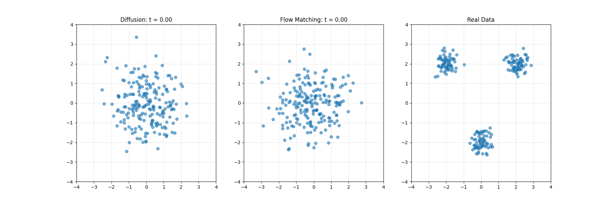

# Diffusion vs Flow Matching Comparison

This repository provides a visual comparison between two generative modeling approaches: Diffusion Models and Flow Matching. The implementation focuses on a simple 2D toy dataset to help understand and visualize the fundamental differences between these methods.



## Overview

### Diffusion Models
Diffusion models work by gradually adding noise to data and then learning to reverse this process. They:
- Start with pure noise
- Gradually denoise the data through multiple steps
- Use a neural network to predict and remove noise at each step
- Follow a predefined noise schedule

### Flow Matching
Flow matching directly learns a continuous transformation between noise and data distributions. They:
- Learn velocity fields that transform noise to data
- Use a single neural network to predict velocities
- Transform data in a single continuous flow
- Don't require a noise schedule

In this implementation, we use a linear interpolation path with added noise:
```python
x_t = (1 - t) * z + t * x_0 + noise * torch.sqrt(t * (1 - t))
```
where:
- `z` is the noise distribution
- `x_0` is the target data
- `t` is the time parameter (0 to 1)
- `noise` is small Gaussian noise scaled by `sigma=0.1`
- The noise term `torch.sqrt(t * (1 - t))` ensures smooth transitions

This path choice provides a simple yet effective way to transform between distributions, with the noise term helping to stabilize training and prevent mode collapse.

## Installation

Create a conda environment and install dependencies:

```bash
conda create -n difffm python=3.10
conda activate difffm
pip install torch numpy matplotlib tqdm ipython
```

## Usage

Run the main script to see the comparison:

### Run Diffusion Demo
```bash
python diff_vs_flowmatch.py run-diffusion-demo --n-epochs 200 --batch-size 128 --n-samples 1000
```

### Run Flow Matching Demo
```bash
python diff_vs_flowmatch.py run-flow-matching-demo --n-epochs 200 --batch-size 128 --n-samples 1000
```

### Run Comparison Demo
```bash
python diff_vs_flowmatch.py run-comparison-demo --n-epochs 200 --batch-size 128 --n-samples 1000
```

This will:
1. Train both models on a toy dataset (3 Gaussian clusters)
2. Generate samples from both models
3. Create various visualizations to compare the approaches

## Visualizations

The code generates several types of visualizations:

1. **Sample Comparison**
   - Real vs Generated samples for both methods
   - Shows final quality of generated samples

2. **Trajectory Visualization**
   - Shows how individual points move during generation
   - Helps understand the path from noise to data

3. **Intermediate Steps**
   - Displays snapshots of the generation process
   - Shows how the distribution evolves over time

4. **Vector Fields**
   - Visualizes the learned vector fields at different timesteps
   - Shows how each model guides points toward the data distribution

5. **Animations**
   - Dynamic visualization of the generation process
   - Creates GIFs showing the full transformation

## Implementation Details

The repository contains several key components:

- `SimpleMLP`: Neural network architecture shared by both models
- `DiffusionModel`: Implementation of the diffusion process
- `FlowMatching`: Implementation of the flow matching approach
- Various visualization functions for analysis and comparison

## Key Differences

1. **Training Objective**
   - Diffusion: Predicts noise at each step
   - Flow Matching: Predicts velocity vectors

2. **Generation Process**
   - Diffusion: Discrete steps from noise to data
   - Flow Matching: Continuous flow from noise to data

3. **Sampling**
   - Diffusion: Uses multiple denoising steps
   - Flow Matching: Uses ODE solvers (Euler or Heun's method)

## Results

The visualizations help understand how each method approaches the generation task:

- Diffusion models gradually denoise the data through many small steps
- Flow matching creates a smooth transformation from noise to data
- Both methods can successfully learn the target distribution
- Each method has its own characteristic generation trajectory

## References

- [Denoising Diffusion Probabilistic Models](https://arxiv.org/abs/2006.11239)
- [Flow Matching for Generative Modeling](https://arxiv.org/abs/2210.02747)
- [Blog Post on Diffusion vs Flow Matching](https://harshm121.medium.com/flow-matching-vs-diffusion-79578a16c510)
